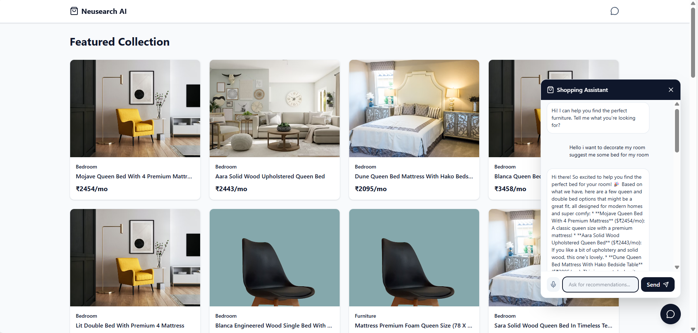
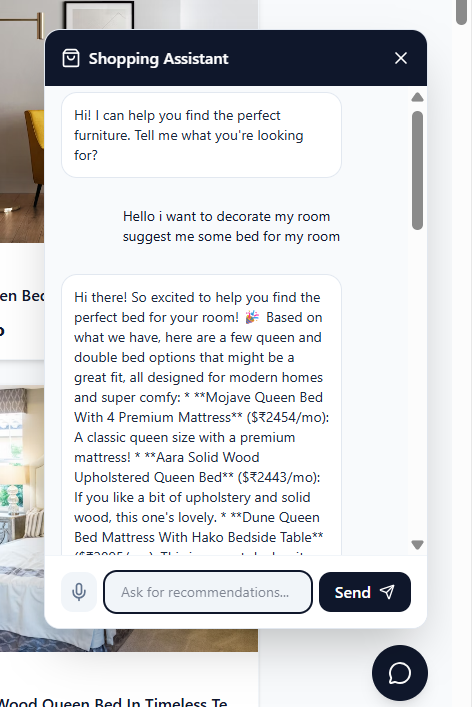
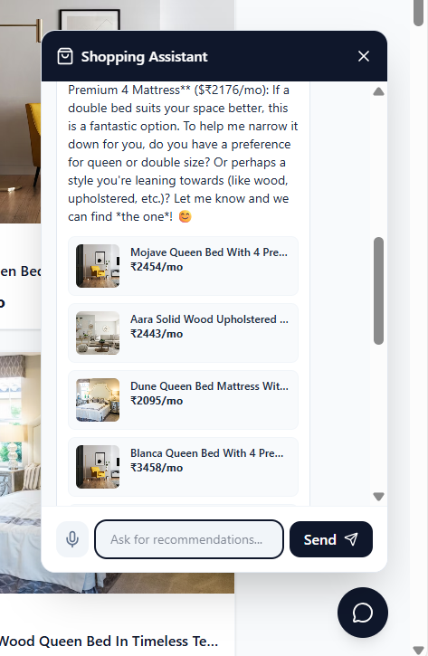

# Neusearch AI 🤖

Neusearch AI is a sophisticated **RAG-powered product discovery engine** designed to help users find the perfect furniture through natural language conversation. It combines a modern React frontend with a powerful Python backend to deliver an intuitive and intelligent shopping experience.

## 🚀 Live Demo

- **Frontend**: [Deployed on Netlify](#)
- **Backend**: [Deployed on Render](#)

## 🛠️ Tech Stack

### Frontend
- **Framework**: ReactJS (Vite)
- **Styling**: TailwindCSS
- **Deployment**: Netlify

### Backend
- **Framework**: FastAPI (Python)
- **Database**: Supabase (PostgreSQL)
- **AI/RAG**: Google Gemini 1.5 + Vector Search
- **Deployment**: Render

## 📸 Screenshots

### Product Discovery Interface
The main interface allows users to browse products and interact with the AI assistant.


### AI Chat Assistant
The intelligent chatbot helps users refine their search and find specific items.
<div align="center">
  
  
</div>

<br/>

## 💻 Local Setup Instructions

Follow these steps to run the project locally on your machine.

### Prerequisites
- **Node.js** (v18+)
- **Python** (v3.10+)

### 1. Clone the Repository
```bash
git clone <repository-url>
cd neusearch-ai
```

### 2. Backend Setup
Navigate to the backend directory and set up the Python environment.

```bash
cd backend
python -m venv .venv
```

**Activate Virtual Environment:**
- **Windows**: `.\.venv\Scripts\Activate`
- **Mac/Linux**: `source .venv/bin/activate`

**Install Dependencies:**
```bash
pip install -r requirements.txt
```

**Configuration (.env):**
Create a `.env` file in the `backend` directory with your credentials:
```env
DATABASE_URL=postgresql://<user>:<password>@<host>:5432/<db_name>
GEMINI_API_KEY=your_gemini_api_key
```

**Run Server:**
```bash
uvicorn app.main:app --reload
```
The backend will start at `http://localhost:8000`.

### 3. Frontend Setup
Open a new terminal, navigate to the frontend directory, and install dependencies.

```bash
cd frontend
npm install
npm run dev
```
The frontend will start at `http://localhost:5173`.

---

### ⚡ Quick Start (Windows Users)
If you are on Windows, you can simply run the provided batch scripts:
1. Run `setup.bat` to install dependencies.
2. Run `start.bat` to launch both frontend and backend.

